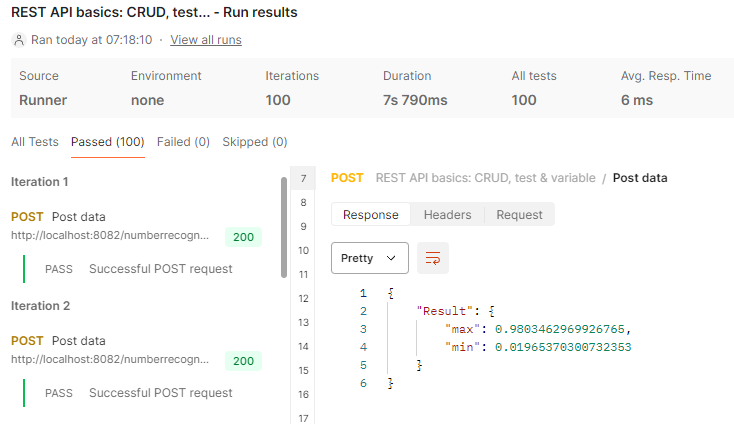

Как запустить:
1) Установить питончик
2) Создать окружение (venv)
3) Накатить пакетики, которые указаны в requirements.txt
4) Запусить файл mainpoint.py
5) Обращение запроса по адресу http://localhost:8082/numberrecogner/recogn (POST)
6) тело запроса:
{
	"regno_recognize": "{{regno_recognize}}",
    "afts_regno_ai": "{{afts_regno_ai}}",
    "recognition_accuracy": "{{recognition_accuracy}}",
    "afts_regno_ai_score": "{{afts_regno_ai_score}}",
    "afts_regno_ai_char_scores": "{{afts_regno_ai_char_scores}}",
    "afts_regno_ai_length_scores":"{{afts_regno_ai_length_scores}}",
    "camera_type":"{{camera_type}}",
    "camera_class":"{{camera_class}}",
    "time_check":"{{time_check}}",
    "direction":"{{direction}}"
}

Из особенностей:
1) Подгрузка модели сразу, чтобы при каждом запросе не переосоздавать ее
2) Использование Blueprint, для потенциального мастабирования
   
Результаты:

